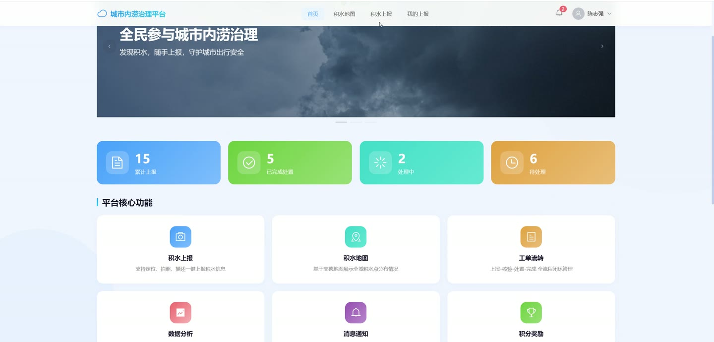
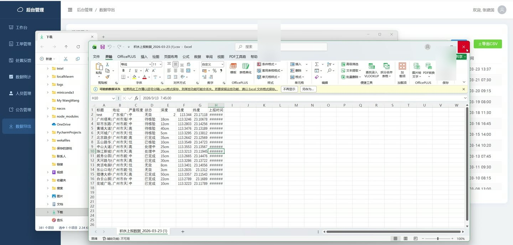
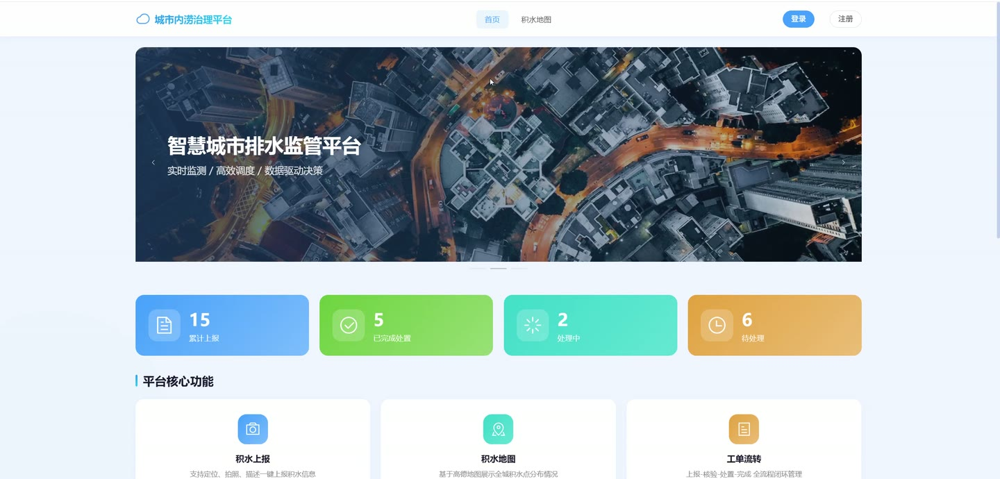
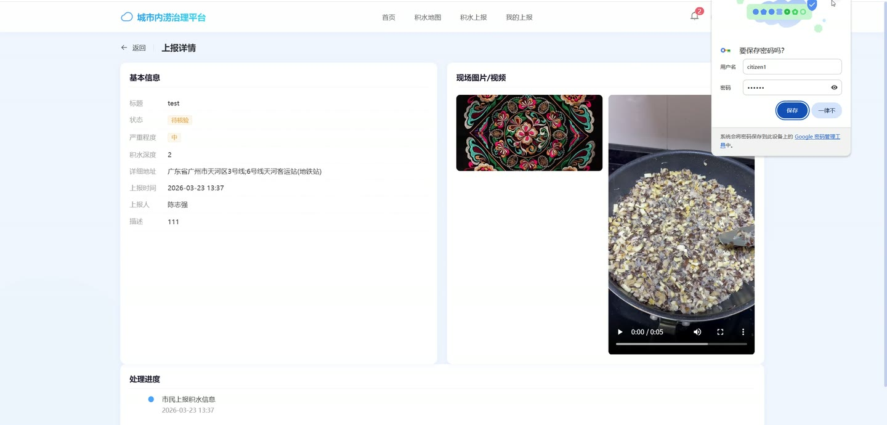
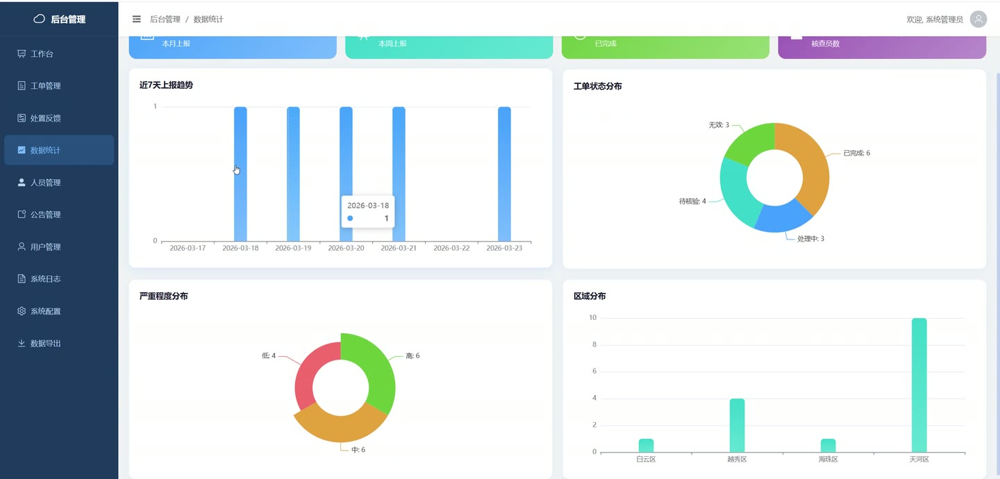
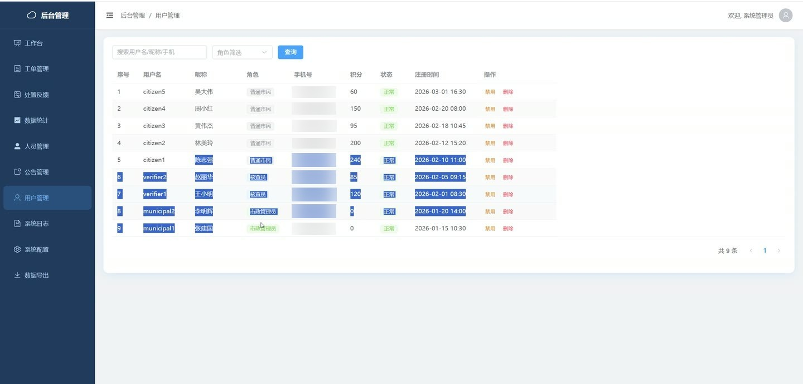

# (附文档)Springboot3+Vue3+MySQL 城市内涝积水点众报与协同治理系统

**技术栈**：Springboot3、Vue3、MySQL

### 系统简介

本系统是基于 SpringBoot3 + Vue3 + MySQL 构建的城市内涝积水点众报与协同治理平台，采用前后端分离架构。系统面向市民、社区核查员、市政处置人员、系统管理员四类角色，实现积水点上报、现场核验、工单处置、积分激励、预警发布的全流程闭环管理。
 
### 核心功能
 
### 市民端

 
- 注册/登录：支持用户名密码注册登录，市民角色注册后直接激活，核查员/市政人员需审核 
- 积水上报：填写标题、描述、积水深度、经纬度、地址、严重程度，并上传图片/视频附件 
- 我的上报：查看本人提交的所有工单列表，支持按状态筛选 
- 工单详情：查看单条上报的完整信息及关联的媒体文件 
- 通知消息：接收工单状态变更通知（提交成功、核验通过/未通过、转派处理、处理完成） 
- 积分记录：查看积分变动明细（上报奖励、核验通过奖励、系统奖励等） 
- 个人信息：查看/修改昵称、头像、手机号等个人资料 
- 修改密码：输入原密码与新旧密码完成密码变更 
- 查看公告：浏览已发布的系统公告列表
 
### 社区核查员端

 
- 待核验列表：查看本区域（按地址匹配）内状态为“待核验”的工单 
- 提交核验：对工单进行现场核验，选择“有效”或“无效”结果，填写备注并上传核验照片 
- 核验记录：查询本人的历史核验记录，含工单标题与核验结果 
- 积分奖励：每次完成核验获得系统配置的积分奖励 
- 通知接收：接收新工单分配及系统通知
 
### 市政处置人员端

 
- 工单列表：分页查看所有工单，支持按状态、关键词、严重程度筛选 
- 处置反馈：对已分配的工单提交处置内容描述与处置照片，可标记为“已完成” 
- 处置记录：查询本人的历史处置记录，关联工单标题 
- 按工单查看处置记录：根据工单ID查看该工单的所有处置反馈 
- 通知接收：收到新工单分配通知与系统通知
 
### 系统管理员端

 
- 工单管理：分页查看全部工单，支持按状态/关键词/严重程度筛选 
- 分配处置人员：从市政处置人员列表中选择人员并分配工单，工单状态自动变为“处理中” 
- 查看核验记录：根据工单ID查看该工单的所有核验记录 
- 用户管理：分页查询用户列表（排除管理员），支持按关键词/角色搜索 
- 用户审核：审核核查员/市政管理员的入驻申请（通过/驳回） 
- 用户状态管理：启用或禁用用户账号 
- 删除用户：删除指定用户账号 
- 数据统计：展示总工单数、待处理/处理中/已完成/无效工单数、今日/本周/本月新增数、用户总数、核查员数 
- 近7天每日统计：按日期展示工单新增趋势 
- 按严重程度统计：统计各严重等级（高/中/低）的工单数量 
- 按状态统计：统计各状态的工单数量 
- 按区域统计：从地址中提取区名，统计各区工单数量 
- 系统日志：分页查询操作日志，支持按操作描述/用户名搜索 
- 系统配置：查看和更新所有系统配置项（如积分奖励值） 
- 预警发布：填写标题和内容，向所有用户推送预警通知 
- 数据导出：按状态/日期范围筛选并导出工单数据 
- 公告管理：新增、修改、删除公告，发布/下架公告 
- 公开统计：首页展示总工单数、已完成数、处理中数、市民注册数（无需登录）
 
### 公开功能（无需登录）

 
- 积水点地图：获取所有有效工单的经纬度与地址信息，用于地图标注 
- 公开统计：查看总工单数、已完成数、处理中数、市民注册数 
- 已发布公告：浏览已发布的公告列表
 
### 技术栈

 后端框架Spring Boot 3 ORMMyBatis-Plus 权限认证Spring Security + JWT 前端框架Vue 3 状态管理Vuex / Pinia 构建工具Vite 数据库MySQL 数据校验Jakarta Validation JSON 处理Jackson 文件上传MultipartFile
 
### 交付内容

 
- 后端完整源码 
- 前端完整源码 
- 数据库初始化脚本 
- 万字文档

## 界面展示

---

## 获取完整源码 + 万字文档

本仓库为项目介绍页。**完整前后端源码、数据库初始化脚本、万字项目文档**，请访问 [codekk.top](http://codekk.top) 获取。

可作课程设计 / 毕业设计参考，支持远程部署调试。